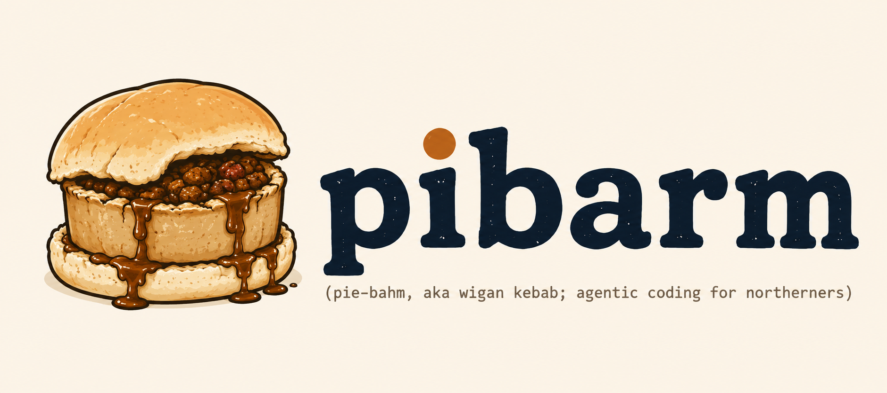

# pibarm

TL;DR pi extensions + skills for safer agent workflows:

- plan first, edit later
- ask explicit questions before executing unclear plans
- notify when questions are waiting, with native notifications and optional Signal fallback
- run risky/parallel work in git worktrees instead of the active repo
- use MCP tools through `mcporter`
- switch model/tool/thinking presets by role
- spawn isolated subagents, including parallel multi-model runs, when useful

## Quick start

From this repo:

```bash
cp .pi/mcporter.example.json .pi/mcporter.json
cp .pi/agent-presets.example.json .pi/agent-presets.json
pi
```

Trust the project when prompted. Pi loads project resources from `.pi/settings.json`.

Development uses Bun:

```bash
bun install
bun run check
```

Use from another project:

```bash
pi install git@github.com:leemeichin/pibarm.git
```


## External pi packages

This project asks pi to load one external package from `.pi/settings.json`:

- `git:github.com/DietrichGebert/ponytail`

Pi installs missing project packages automatically on startup after the project is trusted. To reconcile/update packages later:

```bash
pi update --extensions
```

## Main workflow

```text
/plan <task>
  ↓
pi inspects read-only and asks questions if needed
  ↓
you approve/refine the plan
  ↓
/execute-plan worktree <name>
  ↓
changes happen in a repo-local git worktree, not your active checkout
```

Use active-checkout execution only when you really want it:

```text
/execute-plan
```

## Commands

| Command | What it does |
|---|---|
| `/plan <task>` | Enter read-only plan mode and ask for a plan. |
| `/plan-mode` | Toggle read-only plan mode manually. |
| `/plan-show` | Show the last captured plan, status, and parsed steps. |
| `/approve-plan [active\|worktree <name>]` | Approve and execute the captured plan. |
| `/refine-plan <feedback>` | Revise the captured plan and require approval again. |
| `/execute-plan` | Execute the last captured plan in the active checkout. |
| `/execute-plan worktree <name>` | Execute the last captured plan in a new repo-local git worktree. |
| `/worktrees` | List git worktrees for this repo. |
| `/worktree-diff <path>` | Show status + diff stat for a worktree. |
| `/worktree-remove [--force] <path>` | Remove a worktree after review/merge/abandoning it. |
| `/tasks` | Show all todo and delegated agent task widget items. |
| `/watchers` | List active watcher sibling agents. |
| `/watcher-stop [name]` | Stop watcher sibling agents. |
| `/preset` | List configured role presets. |
| `/preset planner` | Apply planner model/tool/thinking preset. |
| `/preset executor` | Apply executor model/tool/thinking preset. |
| `/mcporter` | Show configured mcporter command templates. |
| `/mcporter <args...>` | Run raw mcporter args from inside pi. |
| `/repo-status` | Show git/forge/CI status and update pi statusline. |
| `/gh-prs` | List open GitHub PRs. |
| `/gh-ci` | List recent GitHub Actions runs. |
| `/srht-builds` | List recent SourceHut builds via `hut`. |
| `/hut <args...>` | Run raw SourceHut `hut` args. |
| `/matrix-help` | Explain when/how to use Matrix and its prior art. |
| `/matrix <task>` | Start a WezTerm Matrix with scout/planner panes. |
| `/matrix-attach` | Open/focus the session-specific Matrix workspace window. |
| `/matrix-spawn <role> <task>` | Spawn one Matrix agent in a WezTerm pane. |
| `/matrix-send <role> <message>` | Send a message to a still-running Matrix pane. |
| `/matrix-capture [role]` | Capture recent output from Matrix panes/logs. |
| `/matrix-join [role\|all]` | Wait for Matrix agents, capture logs, and clean up panes. |
| `/matrix-list` | List Matrix agents and panes for this session. |
| `/matrix-kill [role\|all]` | Kill Matrix panes. |

## Tools exposed to the agent

| Tool | Purpose |
|---|---|
| `elicit_plan_questions` | Ask several planning questions before finalizing/executing a plan, with rich TUI inputs for free text, select, multi-select, confirm/boolean, and number answers. |
| `question` | Ask one focused question with optional choices. |
| `create_git_worktree` | Create an isolated repo-local git worktree and branch. |
| `summarize_worktree_diff` | Summarize status/diff for a worktree. |
| `remove_git_worktree` | Remove an isolated worktree after confirmation/review. |
| `run_worktree_agent` | Create/use a worktree and run `pi -p` there; simple tasks may use a lighter available model. |
| `run_subagent` | Run an isolated non-interactive `pi -p` subagent; simple tasks may use a lighter available model. |
| `run_subagents` | Run several isolated `pi -p` subagents in parallel; simple jobs may use lighter available models unless set. |
| `watch_agent` | Start/list/stop a sibling watcher agent for PR reviews, checks, or external state changes. |
| `mcporter_list` | Discover MCP servers/tools through `mcporter`. |
| `mcporter_call` | Call MCP tools through `mcporter`. |
| `mcporter_resource` | List/read MCP resources through `mcporter`. |
| `repo_status` | Summarize branch, dirty files, forge, PR, and CI status. |
| `github_prs` | List GitHub PRs through `gh`. |
| `github_pr_status` | Inspect current/selected PR review and check status. |
| `github_ci_status` | List GitHub Actions runs through `gh`. |
| `sourcehut_builds` | List SourceHut builds through `hut`. |
| `sourcehut_tickets` | List SourceHut tickets through `hut`. |
| `todo_list` | Track progress when one prompt contains multiple requested tasks in the shared task widget. |
| `matrix_spawn` | Spawn a parent-controlled pi agent in a WezTerm Matrix pane. |
| `matrix_attach` | Open the Matrix WezTerm workspace. |
| `matrix_send` | Send a message to a still-running Matrix WezTerm pane. |
| `matrix_capture` | Capture recent output from Matrix WezTerm panes/logs. |
| `matrix_join` | Wait for Matrix agents to finish, capture logs, and clean up panes. |
| `matrix_list` | List known Matrix agents and untracked Matrix workspace panes. |
| `matrix_kill` | Kill Matrix WezTerm panes. |

## Rich planning questions

`elicit_plan_questions` accepts either strings or typed question objects. Strings become free-text prompts. Objects can use `type: "free_text"`, `"select_one"`, `"select_many"`, `"confirm"`, `"boolean"`, or `"number"`, plus optional `label`, `options`, `default`, `min`, `max`, `preview`/`actionPreview`, `notes`, and `allowCustom`.

```json
{
  "questions": [
    { "label": "Scope", "question": "What should change?", "type": "select_many", "options": ["UI", "Tool schema", "Docs"] },
    { "label": "Proceed", "question": "Apply schema changes?", "type": "confirm", "preview": "Keeps string questions backward-compatible." },
    { "label": "Retries", "question": "How many retries?", "type": "number", "default": 2, "min": 0, "max": 5 }
  ]
}
```

The TUI is tabbed, has Nerd Font status icons, supports option descriptions/previews, and lets you add per-question notes with `n`.

## Task widget

`todo-list.ts`, headless subagents, worktree agents, watcher agents, and Matrix agents share one compact widget below the editor/above the status line. It renders clean horizontal pills such as `‹ ○ 1 · inspect auth › ‹ ● matrix scout · matrix-app › ‹ ✓ sub reviewer · gpt-5-mini ›` so delegated work stays visually connected to the parent session/workspace without a tall vertical list. Use `/tasks` for the expanded view when pills overflow.

## Watcher agents

`watch_agent` starts a sibling watcher that polls external state and runs a headless Pi task only when the observed state changes. The primary use case is PR follow-up while the parent Pi session remains active:

```text
watch_agent(action=start, pr="123", goal="Keep this PR moving toward approval", loop="Watch for review comments, requested changes, and failed checks; respond only when useful")
```

It accepts either legacy `task` or Claude Code-style `goal` + `loop`. It writes logs under `.pi/watchers/`, appears in the shared task widget, and can be stopped with `/watcher-stop [name]` or `watch_agent(action=stop, name="...")`.

## Plan mode behavior

When plan mode is active:

- `edit` and `write` are disabled
- bash is restricted to read-only-ish commands
- pi is instructed to ask clarifying questions when scope/risks/acceptance criteria are unclear
- final plans should include validation steps and whether worktree execution is recommended

After a plan is captured, pi prompts you to:

- approve execution in a worktree
- approve execution in the active checkout
- refine the plan, then require approval again
- keep the plan for later

You can also use `/approve-plan [active|worktree <name>]` or `/refine-plan <feedback>` after the prompt. Refinements preserve the current captured plan as context and replace it only when a revised plan is captured.

## Worktrees

`/execute-plan worktree feature-x` creates a repo-local checkout like:

```text
.pi/wt/feature-x
```

with branch:

```text
pibarm/feature-x
```

The agent is instructed to make changes under that worktree path, preserving your active checkout. `.pi/wt/` is gitignored.

Review and cleanup:

```text
/worktrees
/worktree-diff .pi/wt/feature-x
/worktree-remove .pi/wt/feature-x
```

For agent-driven review, ask pi to use `summarize_worktree_diff`.


## Matrix WezTerm agents

`matrix.ts` is WezTerm-native orchestration for visible parent-controlled agents. It opens agents in WezTerm tabs/splits and keeps only lightweight pane tracking in Pi. Use `/matrix-help` inside Pi for the quick operating guide.

```text
/matrix investigate flaky tests
/matrix-attach
/matrix-spawn worker fix the failing test
/matrix-join worker
/matrix-kill all
```

Defaults:

- spawned agents use the current active model unless `model` is set explicitly; simple-scope tasks may use a lighter authenticated model
- agents run non-interactively in WezTerm, print a visible start/log banner, write logs under `.pi/matrix/`, and panes exit when tasks finish
- `matrix_join` waits for completion, returns logs, and cleans up pane tracking
- Matrix uses a project/session-specific workspace name like `matrix-<project>-<session>` to avoid cross-session conflicts, opens/focuses a visible WezTerm client automatically, and splits that window unless `placement: "tab"` is explicit
- `scout` and `planner` use read-focused toolsets
- `worker` uses normal tools
- `worktree: true` on `matrix_spawn` creates an isolated branch/worktree when the agent needs separate branch work
- same-branch/distributed work uses the current checkout
- `/matrix-kill all` also closes untracked panes left in the Matrix workspace

## Notifications and permission gates

`waiting-notify.ts` sends a terminal/native notification when `question` or `elicit_plan_questions` is waiting. On macOS, if the machine has been idle for 5 minutes and `signal-cli` is available, the question tools send a Signal note-to-self prefixed with `π` and read back your next reply.

Optional notification env vars:

```bash
export PI_NOTIFY_SIGNAL_TO=+15555550123           # optional; default is Signal note-to-self
export PI_NOTIFY_SIGNAL_ACCOUNT=+15555550123      # optional
export PI_NOTIFY_SIGNAL_ACCOUNT_FLAG=-a           # default; use -u if your signal-cli needs it
export PI_NOTIFY_SIGNAL_CLI=/path/to/signal-cli   # optional if not on PATH
export PI_NOTIFY_TERMINAL_NOTIFIER=/opt/homebrew/bin/terminal-notifier # optional
export PI_NOTIFY_SIGNAL_FORCE=1                  # optional; test Signal without waiting for idle
export PI_NOTIFY_SIGNAL_REPLY_SECONDS=600        # optional
```

`permission-gate.ts` is disabled by default because the current heuristic is too intrusive. Set `PI_PERMISSION_GATE=1` to temporarily re-enable risky bash/write prompts while the smarter gate is redesigned.

## Inline shell

Type `!<command>` as a prompt to run a local shell command immediately and show the output in the transcript, without invoking the model. `!!` is left to Pi's built-in bash handling.

```text
!git status --short
```

## Forge/statusline integrations

`repo-status.ts` installs a colorful icon-first footer with project/model/context/thinking on the left and repo/forge/CI status on the right. It includes dirty/uncommitted diff stats, detects Jira-style ticket IDs from branch names, and filters Ponytail extension chatter. Example:

```text
 pibarm · 󰚩 anthropic/Sonnet 4 5 · 󰯌 ctx 37%         main ±2 ·  #12 ·  CI
```

Colour mapping:

- PR: green open, grey draft, purple/accent merged, red closed
- CI: green pass, yellow/orange running, red failing, grey unknown

It uses local CLI auth only:

- GitHub: `gh` (`gh auth login`)
- SourceHut: `hut`

No tokens are stored in this repo.

## Mcporter

`mcporter` is used as the MCP CLI bridge. Configure command templates in:

```text
.pi/mcporter.json
```

Default call template (`callArgs`):

```json
["call", "{selector}", "--args", "{argumentsJson}", "--output", "json"]
```

There are also `listArgs` and `resourceArgs` templates for discovery/resource tools.

Placeholders:

- `{server}`
- `{tool}`
- `{selector}` = `server.tool`
- `{argumentsJson}`
- `{schemaFlag}`
- `{uri}`

Useful direct checks:

```bash
mcporter list --json
mcporter list <server> --schema --json
mcporter call <server.tool> --args '{"key":"value"}' --output json
```

## Presets

Configure role presets in:

```text
.pi/agent-presets.json
```

Start from:

```bash
cp .pi/agent-presets.example.json .pi/agent-presets.json
```

Presets can set:

- provider/model
- thinking level
- active tools

## Skills

Available skill commands:

- `/skill:pr-open`
- `/skill:matrix`
- `/skill:plan-worktree`
- `/skill:mcporter`
- `/skill:agent-orchestration`
- `/skill:model-presets`
- `/skill:ruby`
- `/skill:typescript`
- `/skill:pr-review`
- `/skill:ci-triage`

## Files

```text
AGENTS.md                     # project agent instructions
SECURITY.md                   # local security policy
.pi/APPEND_SYSTEM.md          # project system-prompt addendum
extensions/plan-worktree.ts   # plan mode, elicitation, worktrees
extensions/question.ts        # single-question user prompt tool
extensions/mcporter.ts        # mcporter MCP bridge
extensions/github.ts           # GitHub PR/CI tools via gh
extensions/sourcehut.ts        # SourceHut tools via hut
extensions/repo-status.ts      # git/forge/CI statusline
extensions/waiting-notify.ts   # native/Signal notifications for pending questions
extensions/permission-gate.ts  # opt-in confirmation gate for risky/out-of-project actions
extensions/inline-shell.ts     # run !-prefixed local shell commands inline
extensions/todo-list.ts        # compact todo tracking for multi-task prompts
extensions/watch-agent.ts      # sibling watcher agents for PRs/checks/external state
extensions/usage-limit-status.ts # statusline warning when provider usage limits are hit
extensions/matrix.ts           # WezTerm Matrix parent-controlled agent panes
extensions/agent-presets.ts   # presets and single/parallel subagents
skills/*/SKILL.md             # progressive-disclosure workflows
prompts/plan-execute.md       # reusable plan/execute prompt
prompts/pr-open.md            # newline-safe PR opening prompt
.pi/*.example.json            # local config examples
```
