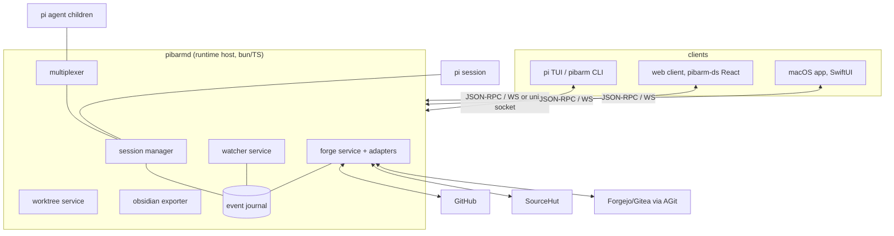

# pibarm runtime design

> Stage 2 of 3: [[pibarm runtime PRD|PRD]] → **design doc** → GitHub issues ([[roadmap and issue seeds|seeds]]). This is the hub note; each subsystem has its own note.

## Shape of the thing

One headless host owns everything; every surface is a client. pi stays the agent core; pibarm's extensions stay the behaviour; the host is new plumbing that makes both addressable.

Guiding constraints, inherited from the PRD:

- Parity is enforced in the host, rendered in the clients ([[parity matrix]]).
- Local-first; the host never becomes a service pibarm operates.
- The CLI keeps working standalone; host attach is additive.

## Subsystem notes

| Note | Covers |
| --- | --- |
| [[runtime core and protocol]] | `pibarmd`, session lifecycle, event journal, JSON-RPC surface, pi embedding strategy, CLI dual-mode |
| [[sessions and multiplexing]] | Matrix generalisation, agent tree, roles/toolsets, pane policy, capture/join semantics |
| [[forge integration]] | `ForgeAdapter` contract, capability flags, GitHub/SourceHut depth, AGit protocol, review threads model, auth |
| [[web client]] | Architecture, pibarm-ds reuse, serving model, offline/reconnect, notifications |
| [[macos app]] | SwiftUI shell, agent grid, diff review, menu bar extra, distribution |
| [[windows and linux]] | Strategy so nothing above becomes macOS-shaped; Tauri-reuse plan |
| [[security, permissions and notifications]] | Host auth, transport stance, permission gates as runtime policy, notification fan-out |

## Decision log

Numbered so the PRD, sub-notes, and eventual issues can cite them.

| # | Decision | Why | Alternatives set aside |
| --- | --- | --- | --- |
| D1 | New host process `pibarmd` in TypeScript on bun, living in this repo | Reuses the extension code and team fluency; extensions already model every behaviour we need to lift | Rust core (rewrite cost, no reuse); making pi itself the daemon (not ours to own) |
| D2 | Clients speak JSON-RPC 2.0 over WebSocket (unix socket locally), events as notifications over the same pipe | Boring, debuggable, trivially bridged to Swift/JS; matches "boring protocols" principle | gRPC (codegen weight for three first-party clients); SSE+REST split (two pipes to keep honest) |
| D3 | Event-sourced session journal (append-only JSONL per session) as the single source of truth; reattach = replay + tail | Gives detach/reattach, capture, Obsidian export, and audit from one mechanism; matches pi's session format habits | In-memory state with snapshots (loses history), SQLite-first (journal can gain an index later if needed) |
| D4 | pi embedding: drive pi headless per session via its programmatic/RPC surface; pty-wrap fallback if fidelity gaps found (M1 spike decides) | Full-fidelity events wanted; but must not gamble the milestone on an undocumented surface | Forking pi (maintenance trap) |
| D5 | Matrix becomes host-side multiplexing; WezTerm is demoted to one renderer used by the CLI surface | Removes the emulator dependency for GUI surfaces while keeping CLI behaviour identical | Remote-controlling WezTerm from GUI clients (absurd), dropping WezTerm entirely (breaks CLI users) |
| D6 | Forge access through one `ForgeAdapter` interface with capability flags; CLI-auth (`gh`/`hut`) preferred, keychain tokens as fallback | Depth without N×M surface/forge features; credential rule unchanged from today | Per-forge bespoke UIs (drift), tokens in config (never) |
| D7 | Review model is *threads on a changeset*, not "PRs" | SourceHut email review and AGit flows fit; GitHub PRs are the special case that maps down easily | PR-shaped model with SourceHut shimmed in (permanent second-class citizen) |
| D8 | Web client is served by the host itself; version-matched, no separate deployment | Kills version skew and hosting/auth questions in one move | Hosted SPA on the existing Cloudflare site (adds auth, CORS, skew for zero benefit) |
| D9 | macOS app is native SwiftUI speaking the protocol directly; Windows/Linux later reuse the web client inside Tauri | "Native" was the explicit ask for macOS; Tauri route keeps the other desktops cheap without shaping macOS around a webview | All-Tauri (not native enough for the stated goal); three native apps (unaffordable) |
| D10 | Host binds localhost by default; remote attach is user-transported (SSH/tailnet) with a bearer token; no pibarm TLS/PKI | Small, honest security surface; users who want remote access already have the tools | Built-in tunnel service (scope), mTLS provisioning (ceremony) |
| D11 | AGit ships as a capability of the git layer plus a Forgejo-family adapter, after GitHub/SourceHut depth | Protocol is push-side only; review-side still needs a per-forge API; sequencing follows PRD M4→M5 | Leading with AGit (smallest user base of the three) |

## Cross-cutting invariants

- **Safety gates are host policy.** Plan-mode tool restrictions, worktree-only execution, the fourth-agent confirmation, permission gates: all enforced in `pibarmd` so a buggy or malicious client cannot widen them. Clients only ever *render* a gate, never implement one. ([[security, permissions and notifications]])
- **Bounded payloads everywhere.** Tool results in the journal and over the wire follow the Obsidian exporter's discipline: compact, bounded rows with on-demand expansion, so transcripts stay attachable on slow links.
- **Capability negotiation.** Hosts advertise feature+forge capabilities at attach; clients hide what the host can't do. This is how older CLIs, partial forge adapters, and future surfaces coexist without version pain.
- **Voice and look.** All surfaces use the pibarm design system (tokens, StatusLine, TaskPill, Terminal, the status glyph set `○ ● ✓ ! ±`). The web ships pibarm-ds directly; macOS maps the token palette into native controls. Sentence case, lowercase pibarm, no emoji.

## What stage 3 needs from this doc

Each sub-note ends with an "issue seeds" list; [[roadmap and issue seeds]] collates them against the PRD milestones. When the open questions in the PRD and D4's spike resolve, that note becomes the GitHub issue tracker import.
