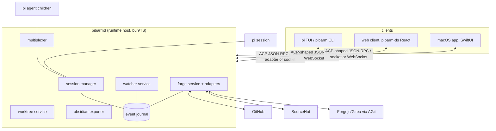

# pibarm runtime design

> Stage 2 of 3: [[pibarm runtime PRD|PRD]] → **design doc** → GitHub issues ([[roadmap and issue seeds|seeds]]). This is the hub note; each subsystem has its own note.

## Shape of the thing

One headless host owns everything; every surface is a client. pi stays the agent core; pibarm's extensions stay the behaviour; the host is new plumbing that makes both addressable.

Guiding constraints, inherited from the PRD:

- Parity is enforced in the host, rendered in the clients ([[parity matrix]]).
- Local-first; the host never becomes a service pibarm operates.
- The CLI keeps working standalone; host attach is additive.

## Subsystem notes

| Note                                        | Covers                                                                                                       |
| ------------------------------------------- | ------------------------------------------------------------------------------------------------------------ |
| [[runtime core and protocol]]               | `pibarmd`, Pi SDK lifecycle, event journal, ACP boundary and transports, CLI dual-mode                       |
| [[sessions and multiplexing]]               | agent tree, roles/toolsets, pane policy, capture/wait semantics                                              |
| [[forge integration]]                       | `ForgeAdapter` contract, capability flags, GitHub/SourceHut depth, AGit protocol, review threads model, auth |
| [[web client]]                              | Architecture, pibarm-ds reuse, serving model, offline/reconnect, notifications                               |
| [[macos app]]                               | SwiftUI shell, agent grid, diff review, menu bar extra, distribution                                         |
| [[windows and linux]]                       | Strategy so nothing above becomes macOS-shaped; Tauri-reuse plan                                             |
| [[security, permissions and notifications]] | Host auth, transport stance, permission gates as runtime policy, notification fan-out                        |
| [[language intelligence]]                   | One bounded code-intelligence tool, trusted server discovery, lazy LSP lifecycle and graceful fallback       |

## Decision log

Numbered so the PRD, sub-notes, and eventual issues can cite them.

| #   | Decision                                                                                                                                                                                                                           | Why                                                                                                                                    | Alternatives set aside                                                                                      |
| --- | ---------------------------------------------------------------------------------------------------------------------------------------------------------------------------------------------------------------------------------- | -------------------------------------------------------------------------------------------------------------------------------------- | ----------------------------------------------------------------------------------------------------------- |
| D1  | New host process `pibarmd` in TypeScript on bun, living in this repo                                                                                                                                                               | Reuses the extension code and team fluency; extensions already model every behaviour we need to lift                                   | Rust core (rewrite cost, no reuse); making pi itself the daemon (not ours to own)                           |
| D2  | ACP v1 is the client semantic boundary: standard session methods and updates, `_pibarm/*` extensions for host features; stdio is the interoperability transport and first-party clients also use an ACP-shaped WebSocket transport | Reuses an editor-facing standard without pretending its remote transport RFD is final; JSON-RPC stays debuggable and Swift/JS friendly | A wholly custom protocol (permanent adapter burden); claiming WebSocket is standard ACP before ratification |
| D3  | Event-sourced session journal (append-only JSONL per session) as the single source of truth; reattach = replay + tail                                                                                                              | Gives detach/reattach, capture, Obsidian export, and audit from one mechanism; matches pi's session format habits                      | In-memory state with snapshots (loses history), SQLite-first (journal can gain an index later if needed)    |
| D4  | Embed Pi's pinned `AgentSessionRuntime`/SDK per session and map its lifecycle/tool events into ACP updates and the journal                                                                                                         | Pi 0.81 documents the required runtime and exported events; direct SDK control keeps tool gates and cancellation structured            | Pty scraping (lossy duplicate state); forking Pi (maintenance trap); making Pi itself the daemon            |
| D5  | Child agents become host-side multiplexing; tmux and Zellij remain adapter renderers used by the CLI surface                                                                                                                       | Keeps CLI visibility terminal-independent while GUI surfaces render native agent panes                                                 | Remote-controlling terminal multiplexers from GUI clients, dropping visible CLI agents                                       |
| D6  | Forge access through one `ForgeAdapter` interface with capability flags; CLI-auth (`gh`/`hut`) preferred, keychain tokens as fallback                                                                                              | Depth without N×M surface/forge features; credential rule unchanged from today                                                         | Per-forge bespoke UIs (drift), tokens in config (never)                                                     |
| D7  | Review model is _threads on a changeset_, not "PRs"                                                                                                                                                                                | SourceHut email review and AGit flows fit; GitHub PRs are the special case that maps down easily                                       | PR-shaped model with SourceHut shimmed in (permanent second-class citizen)                                  |
| D8  | Web client is served by the host itself; version-matched, no separate deployment                                                                                                                                                   | Kills version skew and hosting/auth questions in one move                                                                              | Hosted SPA on the existing Cloudflare site (adds auth, CORS, skew for zero benefit)                         |
| D9  | macOS app is native SwiftUI speaking the protocol directly; Windows/Linux later reuse the web client inside Tauri                                                                                                                  | "Native" was the explicit ask for macOS; Tauri route keeps the other desktops cheap without shaping macOS around a webview             | All-Tauri (not native enough for the stated goal); three native apps (unaffordable)                         |
| D10 | Host binds loopback/unix socket only by default; remote browser access uses SSH forwarding or Tailscale Serve to proxy HTTPS/WSS to loopback, plus host authentication                                                             | Keeps pibarm out of tunnel/TLS/PKI ownership while giving browsers a secure origin and avoiding direct tailnet exposure                | Built-in tunnel service (scope); raw non-loopback bind as the recommended path (needless exposure)          |
| D11 | AGit ships as a capability of the git layer plus a Forgejo-family adapter, after GitHub/SourceHut depth                                                                                                                            | Protocol is push-side only; review-side still needs a per-forge API; sequencing follows PRD M4→M5                                      | Leading with AGit (smallest user base of the three)                                                         |
| D12 | Language intelligence is one bounded tool over trusted, already-installed language servers, started lazily with grep/read fallback                                                                                                 | Improves navigation and diagnostics without global framework prompt weight, package installs, or one tool per language                 | Bundling/downloading servers; always-on daemons; framework instructions in the core prompt                  |

## Cross-cutting invariants

- **Safety gates are host policy.** Plan-mode tool restrictions, worktree-only execution, the fourth-agent confirmation, permission gates: all enforced in `pibarmd` so a buggy or malicious client cannot widen them. Clients only ever _render_ a gate, never implement one. ([[security, permissions and notifications]])
- **Bounded payloads everywhere.** Tool results in the journal and over the wire follow the Obsidian exporter's discipline: compact, bounded rows with on-demand expansion, so transcripts stay attachable on slow links.
- **Capability negotiation.** ACP initialization advertises standard capabilities plus `_meta.pibarm` feature/forge versions; clients hide what the host cannot do. This is how generic ACP clients, older CLIs, partial forge adapters, and future surfaces coexist.
- **Standard core, namespaced edges.** Session creation/loading, prompts, cancellation, streamed messages, plans, tool updates, and permission requests use ACP. Worktrees, child agents, watchers, forge workflows, journal cursors, and rich elicitation use `_pibarm/*` until a standard capability covers them.
- **Voice and look.** All surfaces use the pibarm design system (tokens, StatusLine, TaskPill, Terminal, the status glyph set `○ ● ✓ ! ±`). The web ships pibarm-ds directly; macOS maps the token palette into native controls. Sentence case, lowercase pibarm, no emoji.

## What stage 3 needs from this doc

Each sub-note ends with an "issue seeds" list; [[roadmap and issue seeds]] collates them against the PRD milestones. When the open questions in the PRD and D4's spike resolve, that note becomes the GitHub issue tracker import.
